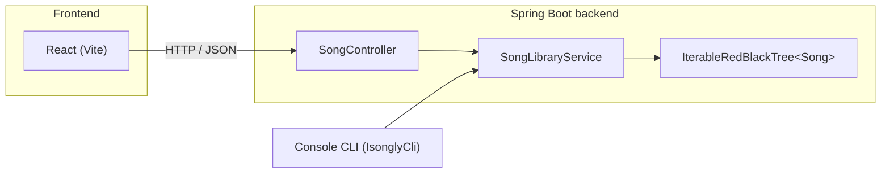

# iSongly

[](https://github.com/Charith-Reddy-Pareddy/isongly-rbt-song-manager/actions/workflows/ci.yml)

A song library backed by a from-scratch Red-Black Tree, exposed through a Spring Boot REST API and a React frontend (with the original text-based CLI kept alongside it).

**Live:** [charith-reddy-pareddy.github.io/isongly-rbt-song-manager](https://charith-reddy-pareddy.github.io/isongly-rbt-song-manager/) (frontend on GitHub Pages, backend on Render's free tier — the API container spins down after inactivity, so the first request after a while can take ~30s to wake it up).

Given a CSV of songs, you can:
- look up songs by BPM range,
- filter them to songs released after a given year (composable with the BPM range),
- pull the five most energetic songs matching the current range/filter,
- and, in the frontend's **Browse & Search** tab, live-search by title/artist, filter by genre, and sort any column — independent of the range/filter state above.

## Origin

This started as a CS400 (Data Structures) coursework project at UW–Madison: implement a Binary Search Tree, add rotations, build a self-balancing Red-Black Tree on top, make it iterable, and use it as the storage engine for a small song-query backend with a partner-built CLI frontend. This repo is that project restructured into a proper Maven build, with several correctness bugs fixed, a REST API layer, and a React UI added on top — see [Notable fixes](#notable-fixes-from-the-original-coursework-version) below.

## Architecture



- **`tree`** — a generic `BSTNode` → `BinarySearchTree` → `BSTRotation` → `RedBlackTree` → `IterableRedBlackTree` chain, each layer adding one capability (rotation, self-balancing insertion, bounded in-order iteration). Nothing here knows about songs.
- **`service`** — `SongLibraryService` parses the CSV, stores `Song` objects in the tree (ordered by title), and answers range/filter/top-five queries by walking the tree and re-sorting the eligible subset by BPM or energy as needed.
- **`web`** — `SongController` exposes that service over REST; `IsonglyApplication` is the Spring Boot entry point and loads the bundled sample dataset on startup.
- **`cli`** — `IsonglyCli` / `ConsoleFrontend` is the original text menu (`L`/`G`/`F`/`D`/`Q`), unchanged in behavior, now driven by the same `SongLibraryService`.

The frontend has two tabs: **Browse & Search** (`search`/`genres` endpoints — a stateless query over the whole library, unaffected by the range/filter below) and **Original Assignment API** (`range`/`filter`/`top-five` — the exact stateful query model the CS400 spec required, where a BPM range set by one call persists for later calls until changed).

## Notable fixes from the original coursework version

While restructuring, a few real bugs surfaced (all now covered by regression tests):

1. **BPM range wasn't remembered.** `getRange(low, high)` computed a filtered list but never stored `low`/`high` anywhere, so the spec's promise that "this range will also be used by future calls to setFilter and fiveMost" didn't actually hold — every later query silently ignored it.
2. **Clearing the year filter also cleared the BPM range.** An operator-precedence bug (`a || b && c` instead of `(a || b) && c`) meant that passing `null` to `setFilter` to clear the year filter also bypassed the BPM range check entirely.
3. **"Five most energetic" wasn't sorted by energy.** `fiveMost()` just took the first five songs in tree (title) order — it happened to pass the original unit tests because the test fixture's three songs were coincidentally pre-sorted by energy.
4. **Every song's genre was silently dropped.** The `Song` constructor had `this.genres = genres;` — a self-assignment that never touched the `genre` constructor parameter, so `getGenre()` always returned `null`.

## Project structure

```
isongly-rbt-song-manager/
├── backend/     Spring Boot + Maven (Java 21)
│   ├── src/main/java/com/isongly/
│   │   ├── model/    Song
│   │   ├── tree/     BSTNode, BinarySearchTree, BSTRotation, RedBlackTree, IterableRedBlackTree
│   │   ├── service/  BackendInterface, SongLibraryService, TrendingChartService
│   │   ├── cli/      FrontendInterface, ConsoleFrontend, IsonglyCli (console entry point)
│   │   └── web/      IsonglyApplication (Spring Boot entry point), SongController, TrendingController, dto/
│   ├── src/main/resources/songs.csv, songs-extra.csv   bundled song library (26,760 songs total)
│   ├── src/main/resources/trending.csv                 bundled Billboard Hot 100 snapshot (see below)
│   └── src/test/java/...              JUnit 5 tests (tree, service, CLI, REST)
└── frontend/    React + Vite
    └── src/
        ├── App.jsx, api.js, index.css, App.css
        └── components/   BrowsePanel, SpecDemoPanel, SongTable, StatBar
```

## Running it

### Backend (REST API on :8080)

```bash
cd backend
./mvnw spring-boot:run
```

On startup it loads `src/main/resources/songs.csv` automatically. Run `./mvnw test` to run the full test suite (Red-Black Tree invariants, rotation correctness, service-level regression tests for the bugs above, CLI integration tests, and REST integration tests).

### Frontend (Vite dev server on :5173)

```bash
cd frontend
npm install
npm run dev
```

The frontend talks to `http://localhost:8080` by default; override with a `VITE_API_BASE_URL` env var if the backend runs elsewhere. CORS on the backend accepts any `http://localhost:*` origin in dev, so this works regardless of which port Vite ends up on. Run `npm test` for the Vitest/Testing Library suite (component rendering, sort/search debounce and request-cancellation logic, URL state sync, API error handling).

### Original CLI

```bash
cd backend
./mvnw compile exec:java -Dexec.mainClass=com.isongly.cli.IsonglyCli
```

## Deployment

- **Frontend** — `.github/workflows/deploy-frontend.yml` builds `frontend/` with Vite and publishes it to GitHub Pages on every push to `main` that touches `frontend/**`. The `VITE_API_BASE_URL` repo variable is baked in at build time.
- **Backend** — `render.yaml` at the repo root is a [Render Blueprint](https://render.com/docs/blueprint-spec): a Docker web service built from `backend/Dockerfile`, free plan, with `APP_CORS_ALLOWED_ORIGINS` set to the Pages origin. Connect it once via Render's dashboard (New + → Blueprint → select this repo); after that, Render redeploys automatically on every push to `main`.
- **CI** — `.github/workflows/ci.yml` runs the full backend (`mvnw test`) and frontend (`npm test` + `npm run build`) suites on every push and pull request to `main`, independent of the deploy workflows above.

## API

| Method | Path                     | Description                                                        |
|--------|--------------------------|----------------------------------------------------------------------|
| GET    | `/api/songs/range`       | `?min=&max=` — songs by BPM range (either bound optional)          |
| GET    | `/api/songs/filter`      | `?year=` — songs released after `year`, within the last BPM range  |
| GET    | `/api/songs/top-five`    | up to five most energetic songs in the current range/filter        |
| POST   | `/api/songs/reset`       | clears the BPM range and year filter                               |
| POST   | `/api/songs/upload`      | multipart CSV upload, replaces the loaded library                  |
| POST   | `/api/songs/reload-sample` | discards whatever was uploaded and restores the bundled 26,760-song dataset |
| GET    | `/api/songs/search`      | `?q=&genre=&sortBy=&sortDir=` — free-text search + sort, ignores range/filter state |
| GET    | `/api/songs/genres`      | every distinct genre in the loaded library, alphabetically         |
| GET    | `/api/trending`          | a fixed Billboard Hot 100 chart-week snapshot (see below)          |

### Song library data

The library loads two bundled CSVs at startup, both in the same 14-column schema so they parse with no code changes:
- **`songs.csv`** — the original 600-song CS400 dataset (2010–2019).
- **`songs-extra.csv`** — 26,160 deduplicated songs from the CC0-licensed [TidyTuesday Spotify Songs dataset](https://github.com/rfordatascience/tidytuesday/tree/main/data/2020/2020-01-21) (spans 1957–early 2020), added to broaden genre and era coverage.

Genuinely current (2023+) song data with full audio features (BPM, energy, danceability, etc.) isn't freely available the way it used to be — Spotify locked down its audio-features API for new developer apps in late 2024, so recent public datasets either omit audio features, omit release dates, or (in at least one case checked) turned out to be synthetic data presented as real, which was rejected rather than bundled. The **Trending** tab below covers genuinely current data instead, just without audio features. Because the two song datasets were collected independently, a small number of songs (mostly from artists active right at the 2019–2020 boundary) appear once from each source with slightly different computed values — this is normal, honest overlap between two real datasets, not a duplicate-insertion bug.

The frontend's Browse & Search table renders at most 300 rows at a time (with a note when a search matches more) to keep the DOM responsive at this size; the stat bar and match count always reflect the full result set.

### Trending tab

The **Trending** tab shows a real Billboard Hot 100 chart-week snapshot (rank, title, performer, peak position, weeks on chart, and week-over-week movement) — separate from the audio-feature song library above, since Billboard chart data and Spotify-style audio features aren't the same shape and don't merge cleanly. Sourced from [utdata/rwd-billboard-data](https://github.com/utdata/rwd-billboard-data) (MIT licensed), which scrapes Billboard weekly; the bundled `trending.csv` is a single dated snapshot pulled at build time (chart week 2026-09-19), not a live feed — `TrendingChartService` has no upload/replace path, unlike the song library.

Note: the loaded library is a single shared, in-memory instance — there's no per-user session, so an upload replaces the dataset for every visitor (this mirrors the original single-user CLI's design; see `SongLibraryService`). `reload-sample` exists specifically so an upload (accidental or otherwise, including your own testing) is always recoverable without restarting the server.

## Tech

Java 21 · Spring Boot 3 · Maven · JUnit 5 · React 19 · Vite
